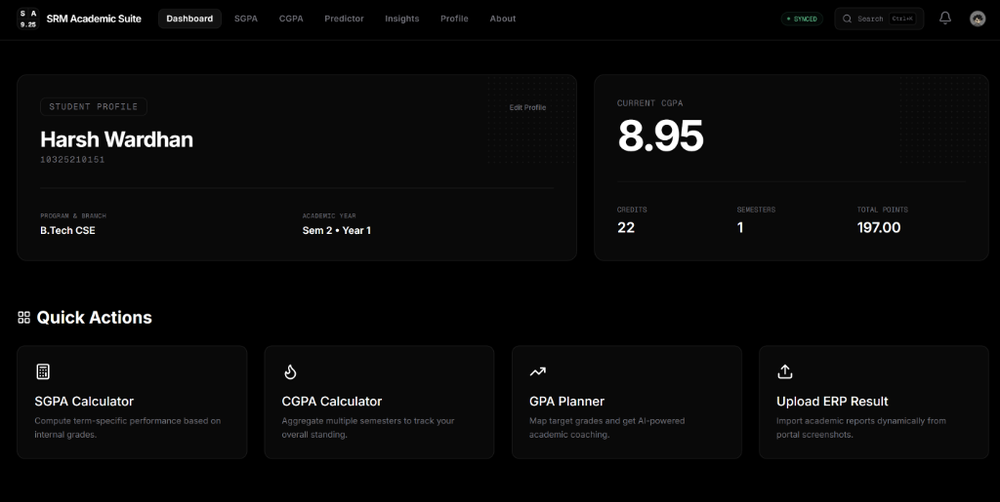
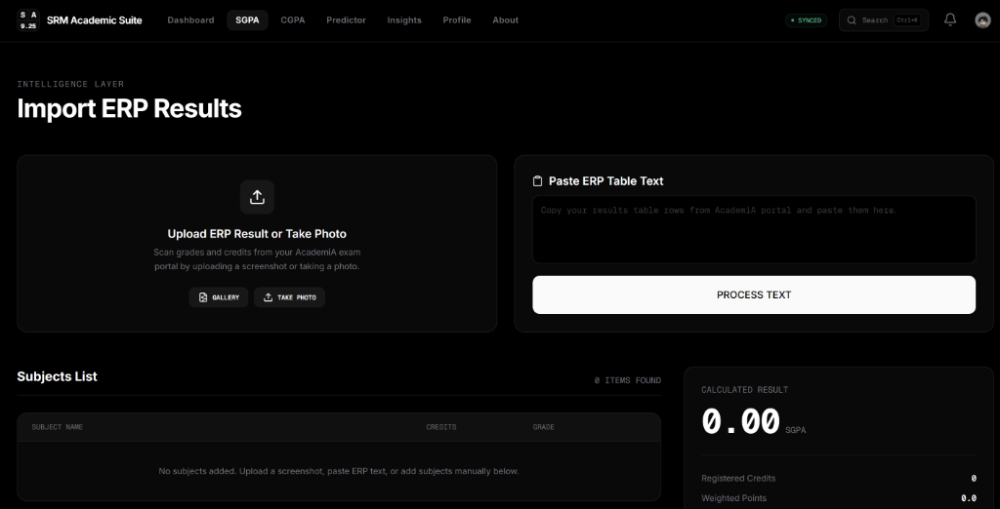
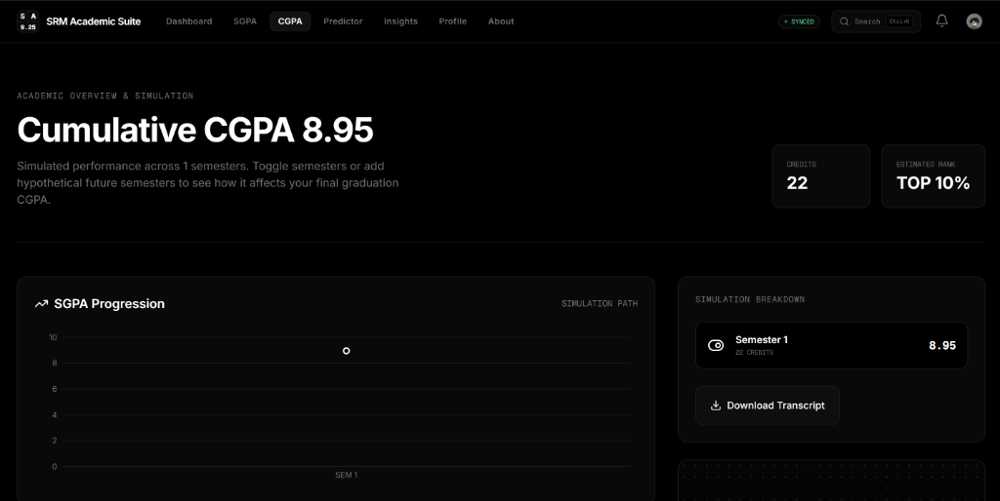
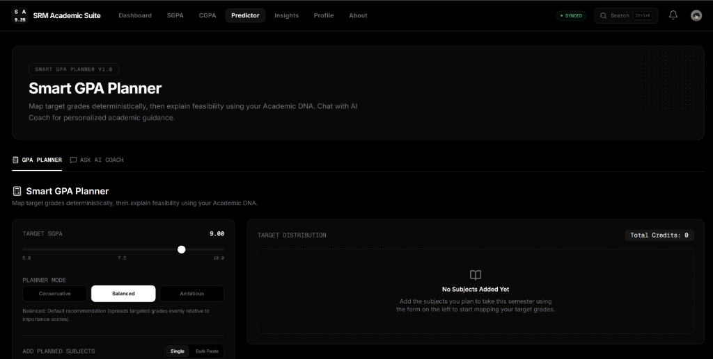
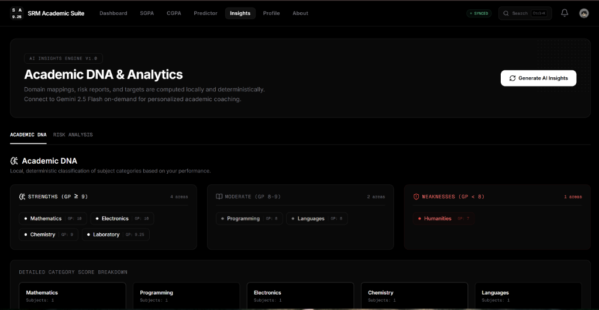
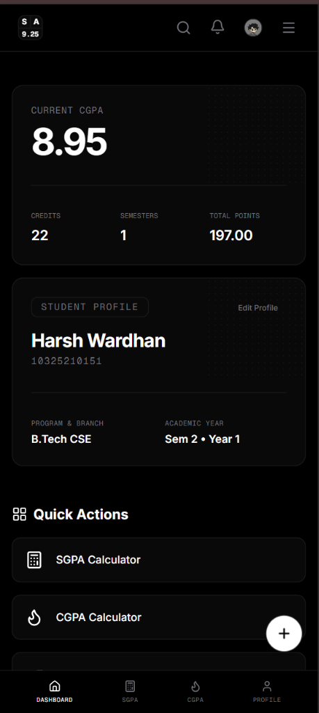

<div align="center">

# 🎓 SRM Academic Suite

**An AI-powered academic analytics platform for SRM students**

[](https://nextjs.org/)
[](https://www.typescriptlang.org/)
[](https://firebase.google.com/)
[](https://ai.google.dev/)
[](https://www.pwabuilder.com/)
[](LICENSE)

[Live Demo](https://srm-cgpa-calculator-by-haruto.vercel.app/) · [Documentation](#-local-development) · [Report Issue](https://github.com/harshwardhan1507/SRM-cgpa-calculator/issues)

</div>

---

## 📖 Overview

Many students know their grades only after results are published. **SRM Academic Suite** empowers students to take control of their academic journey by providing:

- **SGPA Calculation** — Compute semester-specific performance with credit-weighted accuracy
- **CGPA Tracking** — Aggregate multiple semesters to monitor overall academic standing
- **GPA Planning** — Predict future performance and set realistic grade targets
- **ERP Integration** — Import academic reports directly from portal screenshots
- **AI Insights** — Analyze academic strengths, weaknesses, and generate personalized strategies

All calculations run client-side with instant results, backed by Firebase for cloud sync and AI-powered coaching through Gemini.

---

## ✨ Features

### 🧮 Academic Tools
- **SGPA Calculator** — Compute term-specific performance based on internal grades
- **CGPA Calculator** — Aggregate multiple semesters to track degree progress
- **Semester Management** — Organize and edit semester data with ease
- **Credit Tracking** — Monitor total credits earned across all semesters

### 📸 ERP Integration
- **ERP Screenshot Upload** — Import academic reports directly from portal screenshots
- **Smart Text Parsing** — Extract subject names, credits, and grades automatically
- **AI Subject Extraction** — Leverage OCR and AI to parse complex table structures
- **Automatic Grade Detection** — Map letter grades to grade points using SRM scale

### 🎯 GPA Planner
- **Target SGPA Planning** — Set realistic grade targets for upcoming semesters
- **Dynamic Grade Optimization** — Calculate required grades to achieve targets
- **Subject Confidence Modeling** — Mark subjects as strong, average, or weak
- **Feasibility Analysis** — Assess whether targets are achievable given constraints
- **Difficulty Scoring** — Rank subjects by difficulty to prioritize study efforts

### 🤖 AI Academic Insights
- **Academic DNA** — Categorize subjects into domains (Math, Programming, Electronics, etc.)
- **Strength Detection** — Identify academic strengths based on performance patterns
- **Weakness Detection** — Highlight areas requiring improvement
- **Category Analysis** — Compare performance across subject categories
- **Trend Analysis** — Visualize academic progression over time
- **Personalized Advice** — Get AI-powered study recommendations

### 👤 User Management
- **Google Authentication** — Secure login with Google OAuth
- **Student Profiles** — Store registration number, program, branch, and academic year
- **Cloud Sync** — Automatic synchronization across devices via Firebase
- **Persistent Records** — Data persists even when offline

### 📱 Platform
- **Progressive Web App** — Installable on desktop and mobile devices
- **Mobile-First Design** — Optimized for small screens with touch-friendly interface
- **Offline Support** — Works without internet connection using service workers
- **Firebase Backend** — Scalable cloud infrastructure for auth and data storage

---

## 📸 Screenshots

### Dashboard


### SGPA Calculator


### CGPA Calculator


### GPA Planner


### AI Insights


### Mobile View


---

## 🏗️ Architecture

```
User
 │
 ▼
Next.js Frontend (App Router)
 │
 ├── Firebase Authentication
 ├── Firestore Database
 ├── Firebase Storage
 │
 ▼
Academic Analytics Engine
 │
 ├── GPA Calculator (Deterministic)
 ├── Academic DNA (Category Analysis)
 ├── Risk Analysis (Backlog Detection)
 └── GPA Planner (Optimization Algorithm)
 │
 ▼
Gemini AI Layer
 │
 ├── Academic Explanations
 ├── Personalized Study Advice
 ├── GPA Strategy Interpretation
 └── AI Academic Coach
 │
 ▼
User Interface
```

---

## 🧬 Academic DNA System

The platform analyzes semester performance and categorizes subjects into:

- **Mathematics** — Calculus, Linear Algebra, Probability
- **Programming** — C, C++, Python, Java, Data Structures
- **Electronics** — Circuits, Digital Logic, VLSI
- **Physics** — Mechanics, Thermodynamics, Waves
- **Chemistry** — Organic, Inorganic, Physical
- **Languages** — English, Technical Communication
- **Humanities** — Economics, Management, Ethics
- **Laboratory** — Practical sessions and experiments

Then computes:
- **Strengths** — Categories where you consistently perform well
- **Weaknesses** — Categories requiring additional focus
- **Trends** — Performance patterns over time
- **Risk Areas** — Subjects with backlogs or low grades

---

## 🎯 Dynamic GPA Planner

**Input:**
- Target SGPA for upcoming semester
- Subject list with credits
- Confidence level for each subject (Strong/Average/Weak)

**Processing:**
1. Calculate total credits for the semester
2. Compute required grade points to achieve target SGPA
3. Distribute grade points across subjects based on confidence
4. Generate multiple grade distribution strategies
5. Calculate feasibility score for each strategy

**Output:**
- Required grades for each subject
- Multiple optimization strategies
- Feasibility analysis
- Difficulty ranking

**Note:** All calculations are deterministic. No AI is involved in GPA planning to ensure mathematical accuracy.

---

## 🤖 AI Integration

Gemini AI is used for:

- ✅ **Academic Explanations** — Explain complex concepts in simple terms
- ✅ **Personalized Study Advice** — Generate tailored study plans
- ✅ **GPA Strategy Interpretation** — Explain optimization results
- ✅ **AI Academic Coach** — Provide motivational guidance

Gemini AI is NOT used for:

- ❌ **SGPA Calculations** — Pure mathematical computation
- ❌ **CGPA Calculations** — Deterministic aggregation
- ❌ **Grade Optimization** — Algorithm-based planning

This separation ensures accuracy in core calculations while leveraging AI for interpretation and guidance.

---

## �️ Tech Stack

### Frontend
- **Next.js 16.2** — React framework with App Router
- **TypeScript 5.6** — Type-safe JavaScript
- **Tailwind CSS** — Utility-first styling
- **Framer Motion** — Animation library
- **shadcn/ui** — Reusable component library

### Backend
- **Firebase Authentication** — Google OAuth integration
- **Firestore** — NoSQL cloud database
- **Firebase Storage** — File storage for ERP uploads

### AI
- **Gemini 2.5 Flash** — Google's AI model for insights

### Deployment
- **Vercel** — Edge deployment platform

---

## 📂 Folder Structure

```
src
├── app/                    # Next.js App Router pages
│   ├── (app)/             # Application routes
│   │   ├── dashboard/     # Dashboard page
│   │   ├── sgpa/          # SGPA calculator
│   │   ├── cgpa/          # CGPA calculator
│   │   ├── predictor/     # GPA planner
│   │   ├── insights/      # AI insights
│   │   └── profile/       # User profile
│   ├── about/             # Marketing/about page
│   └── api/               # API routes
├── components/            # React components
│   ├── ui/               # shadcn/ui components
│   ├── navbar.tsx        # Navigation bar
│   ├── footer.tsx        # Footer component
│   └── ...               # Other components
├── lib/                  # Utility libraries
│   ├── cgpa.ts          # CGPA calculation logic
│   ├── grade-mapping.ts # Grade to points conversion
│   └── firebase.ts      # Firebase configuration
├── services/             # External service integrations
│   └── prompt-builder.ts # AI prompt construction
├── hooks/                # Custom React hooks
├── providers/            # Context providers
├── types/                # TypeScript type definitions
└── utils/                # Helper functions
```

---

## 🚀 Local Development

### Prerequisites
- Node.js 18+ 
- Firebase Project
- Gemini API Key

### Installation

```bash
# Clone the repository
git clone https://github.com/harshwardhan1507/SRM-cgpa-calculator.git

# Navigate to project directory
cd SRM-cgpa-calculator

# Install dependencies
npm install

# Start development server
npm run dev
```

Open [http://localhost:3000](http://localhost:3000) in your browser.

### Environment Variables

Create a `.env.local` file in the root directory:

```env
# Firebase Configuration
NEXT_PUBLIC_FIREBASE_API_KEY=your_api_key
NEXT_PUBLIC_FIREBASE_AUTH_DOMAIN=your_project.firebaseapp.com
NEXT_PUBLIC_FIREBASE_PROJECT_ID=your_project_id
NEXT_PUBLIC_FIREBASE_STORAGE_BUCKET=your_storage_bucket
NEXT_PUBLIC_FIREBASE_MESSAGING_SENDER_ID=your_sender_id
NEXT_PUBLIC_FIREBASE_APP_ID=your_app_id

# Gemini AI
GEMINI_API_KEY=your_gemini_api_key
```

### Firebase Setup

1. Create a Firebase project at [console.firebase.google.com](https://console.firebase.google.com/)
2. Enable Authentication (Google Sign-In)
3. Create Firestore Database
4. Enable Storage (for ERP uploads)
5. Copy configuration values to `.env.local`

### Gemini AI Setup

1. Get API key from [AI Studio](https://aistudio.google.com/)
2. Add to `.env.local` as `GEMINI_API_KEY`

---

## 🗺️ Roadmap

### Planned Features
- [ ] **Curriculum Engine** — Track degree completion and remaining credits
- [ ] **Semester Comparison** — Compare performance across different semesters
- [ ] **Academic Reports** — Generate PDF reports of academic performance
- [ ] **Export PDF** — Download semester data as PDF
- [ ] **Study Planner** — AI-powered study schedule generator
- [ ] **Attendance Analytics** — Track attendance and correlate with grades
- [ ] **AI Semester Forecasting** — Predict future semester performance

---

## 🤝 Contributing

Contributions are welcome! Here's how you can help:

1. **Fork the repository**
2. **Create a feature branch**
   ```bash
   git checkout -b feature/your-feature-name
   ```
3. **Commit your changes**
   ```bash
   git commit -m "Add your feature"
   ```
4. **Push to the branch**
   ```bash
   git push origin feature/your-feature-name
   ```
5. **Open a Pull Request**

Please ensure your code follows the project's coding standards and includes appropriate tests.

---

## 👨‍💻 Developer

**Harsh Wardhan**  
Full Stack Developer

- 🌐 [Portfolio](https://harshwardhanportfolio.vercel.app)
- 💼 [LinkedIn](https://www.linkedin.com/in/harsh-wardhan-singh-cse/)
- 🐙 [GitHub](https://github.com/harshwardhan1507)
- 📧 [Email](mailto:harshwardhansingh1507@gmail.com)

---

## 📝 Lessons Learned

- **Deterministic Calculation First**: Core algebraic grading calculators must be mathematically deterministic. Relying on LLMs for calculations introduces hallucinations and decreases student trust.
- **Progressive Web App Reach**: Building installable web features (PWA) with persistent local storage is essential for campus utility tools where university Wi-Fi is throttled.
- **Clean Interface Hierarchy**: Dynamic planners require structured confidence inputs to reduce user cognitive load while offering complex optimization paths.

---

## 📄 License

This project is licensed under the MIT License - see the [LICENSE](LICENSE) file for details.

---

<div align="center">

Built with 💚 for SRM students · © 2026 Harsh Wardhan

[⭐ Star this repo](https://github.com/harshwardhan1507/SRM-cgpa-calculator) if it helped you!

</div>
